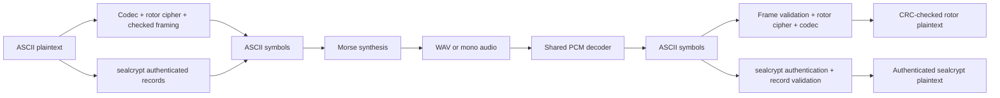

# Architecture

The public package is `src/encrypted_radio`. Python 3.12+ hosts both cipher CLIs;
`cryptography` supplies ChaCha20-Poly1305 and HKDF-SHA256 for `sealcrypt`.
NumPy/SciPy handle PCM processing; sounddevice adapts PortAudio only for live Linux
devices. The optional `demo` extra supplies aiohttp. Vanilla HTML/CSS/JavaScript
provides presentation and browser audio I/O, with no independent cipher or decoder.

## Modules and ownership

| Module | Responsibility |
| --- | --- |
| `config.py`, `data/` | Validated public machine and private rotor key schema; public examples |
| `codec.py`, `rotor.py` | Reversible ASCII escaping and stateful rotor permutation |
| `framing.py`, `cipher.py` | Independent checked blocks, recovery, raw/batch convenience API |
| `rotor_cli.py` | Binary stdin/file/text input; idle flushing; stdout/error status |
| `seal.py` | Shared-key schema, HKDF session derivation, authenticated records and recovery |
| `seal_cli.py` | Compatible text/file/stdin options, private key generation and exit status |
| `streams.py` | Shared incremental pipe reads and idle events for both cipher CLIs |
| `morse.py` | ITU symbol table and profile character rules |
| `audio.py` | Synthesis, spectral acquisition, filtering, timing, WAV adapters |
| `live_audio.py` | PortAudio devices; callbacks and bounded queues |
| `morse_cli.py` | Exclusive TX/RX CLI; text/PCM adapters |
| `demo.py` | Real PCM round trips, seeded noise and removed PCM spans, reports |
| `web.py`, `static/` | Loopback HTTP/WebSocket service and browser presentation |

Each cipher owns its framing and recovery. `sealcrypt` accepts the same public
machine JSON as authenticated context, with a distinct shared-key format; it does
not use rotor wiring to encrypt. It encrypts all 128 ASCII byte values directly,
without the rotor codec's escaping. Its records use Morse-compatible Base32 and the
same acquisition prefix and delimiters, so `morselink` needs no changes. Both ends
of a transfer must use the same cipher and mode; the distinct versioned packets and
private key formats are not interchangeable. A replacement transport carries ordered
ASCII symbols, signals failure and preserves streaming operation. It does not need
access to the key or cipher state. CLI stdout is payload-only.

## State and recovery

`rotorcrypt` raw mode uses one rotor stack and escape decoder until exit. Its
checked mode buffers 128 plaintext bytes by default (configurable from 1 to 256)
and flushes at the block limit, after five idle seconds by default, or at EOF.
Each frame starts from independently derived positions.
A parser holds at most 1,287 Base32 symbols and validates each block before releasing
plaintext using CRC checks, which provide no authentication. Gaps and duplicate/old
blocks are tracked; silence has no framing significance. Checked EOF requires an
end frame; raw rotor output has none. See [PROTOCOL.md](PROTOCOL.md).

`sealcrypt` encrypts up to 256 plaintext bytes per authenticated record and holds at
most 516 Base32 symbols while parsing. A random 32-byte session salt, mode, and full
canonical public machine digest bind each derived session key. Sequence nonces
never wrap. Header and payload authentication precede receive-state changes and
plaintext release. Checked mode buffers and flushes like `rotorcrypt`, reports
damage or gaps, and resumes with intact records. Raw mode emits available input
immediately as bounded records and stops on any detected integrity or ordering
error. Both modes require an authenticated end record and wait for a full record
before releasing plaintext. Recent-session caches are bounded; replay across
receiver restarts remains possible. See [SEALCRYPT.md](SEALCRYPT.md).

The shared pipe reader yields currently available bytes without waiting to fill
its buffer. Raw `sealcrypt` encrypts those bytes immediately, split at the chosen
block size; its receiver still needs the complete record and tag. Idle flushing
affects checked encryption only and never imposes a timeout on a partial received
frame. The [mode comparison](USAGE.md#raw-and-checked-modes) summarizes these
user-visible tradeoffs.

Morse synthesis yields at most 20 ms of mono float32 PCM per chunk. WAV reads and
writes are incremental. Reception finds a concentrated foreground spectral peak,
locks frequency, filters around it, applies adaptive amplitude thresholds with
hysteresis and estimates dot duration from short/long pulse observations. The
`VVV` prefix supplies mixed timing observations. Short ambiguous text may require
`--wpm`; the decoder does not guess from language. WAV and live audio share
`MorseDecoder`.

Live audio queues hold at most two seconds. Callbacks transfer samples without
pipe I/O. Backpressure that causes capture loss is an explicit discontinuity.
Checked/text reception emits `?` on detected uncertainty; raw reception fails.
EOF drains TX; microphone RX runs until stopped.

## Browser boundary

The browser and terminal `er-demo` interfaces remain rotor demonstrations. They use
the shared rotor and DSP modules; `sealcrypt` is a separate CLI/library and has no
independent browser implementation.

The service binds to loopback, validates Host/Origin, serves local assets and
accepts configurations as JSON data. Uploaded configuration cannot name a server
path. An in-memory browser session identifier permits one active WebSocket
operation. Mono float32 PCM uses binary messages; JSON carries control/results.
AudioWorklet reports the actual AudioContext sample rate. Queues, uploads, input
and duration have explicit limits.

Offline results and microphone results occupy distinct UI areas. WAV artifacts
reside in temporary job directories and stream to clients. Keys stay in memory;
the browser does not persist them. Stop/disconnect releases microphone tracks,
contexts and backend work. This local demo is not a multi-user server or a defense
against malicious software on the same computer.

## Evidence and evolution

The lockfile fixes dependency versions. `make check` runs hygiene and application
tests; `make demo` exercises the data path. GitHub retains the required job name and
branch policy. See [VALIDATION.md](VALIDATION.md), [SECURITY.md](../SECURITY.md), and
the complementary decisions [ADR 0002](decisions/0002-rotor-morse-suite.md) and
[ADR 0003](decisions/0003-authenticated-sealcrypt.md).
