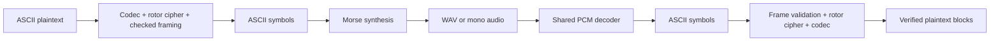

# Architecture

The public package is `src/encrypted_radio`. Python 3.12+ hosts the cipher and CLI;
NumPy/SciPy handle PCM processing; sounddevice adapts PortAudio only for live Linux
devices. The optional `demo` extra supplies aiohttp. Vanilla HTML/CSS/JavaScript
provides presentation and browser audio I/O, with no independent cipher or decoder.

## Modules and ownership

| Module | Responsibility |
| --- | --- |
| `config.py`, `data/` | Validated public machine and private key schema; public examples |
| `codec.py`, `rotor.py` | Reversible ASCII escaping and stateful rotor permutation |
| `framing.py`, `cipher.py` | Independent checked blocks, recovery, raw/batch convenience API |
| `rotor_cli.py` | Binary stdin/file/text input; idle flushing; stdout/error status |
| `morse.py` | ITU symbol table and profile character rules |
| `audio.py` | Synthesis, spectral acquisition, filtering, timing, WAV adapters |
| `live_audio.py` | PortAudio devices; callbacks and bounded queues |
| `morse_cli.py` | Exclusive TX/RX CLI; text/PCM adapters |
| `demo.py` | Real PCM round trips, seeded noise and removed PCM spans, reports |
| `web.py`, `static/` | Loopback HTTP/WebSocket service and browser presentation |

`rotorcrypt` owns recovery. A replacement transport carries ordered ASCII symbols,
signals failure and preserves streaming operation. It does not need access to the
key or the cipher's internal state. CLI stdout is payload-only.

## State and recovery

Raw mode uses one rotor stack and escape decoder until exit. Checked mode buffers
up to 256 plaintext bytes; each frame starts from independently derived positions.
A parser holds at most 1,287 Base32 symbols and validates each block before releasing
plaintext. Gaps and duplicate/old blocks are tracked; silence has no framing
significance. EOF requires an end frame. See [PROTOCOL.md](PROTOCOL.md).

Morse synthesis yields at most 20 ms of mono float32 PCM per chunk. WAV reads and
writes are incremental. Reception finds a concentrated foreground spectral peak,
locks frequency, filters around it, applies adaptive amplitude thresholds with
hysteresis and estimates dot duration from short/long pulse observations. The
`VVV` prefix supplies mixed timing observations. Short ambiguous text may require
`--wpm`; the decoder does not guess from language. WAV and live audio share
`MorseDecoder`.

Live audio queues hold at most two seconds. Callbacks transfer samples without
pipe I/O. Backpressure that causes capture loss is an explicit discontinuity.
Checked/text reception emits `?` on detected uncertainty; raw reception fails.
EOF drains TX; microphone RX runs until stopped.

## Browser boundary

The service binds to loopback, validates Host/Origin, serves local assets and
accepts configurations as JSON data. Uploaded configuration cannot name a server
path. An in-memory browser session identifier permits one active WebSocket
operation. Mono float32 PCM uses binary messages; JSON carries control/results.
AudioWorklet reports the actual AudioContext sample rate. Queues, uploads, input
and duration have explicit limits.

Offline results and microphone results occupy distinct UI areas. WAV artifacts
reside in temporary job directories and stream to clients. Keys stay in memory;
the browser does not persist them. Stop/disconnect releases microphone tracks,
contexts and backend work. This local demo is not a multi-user server or a defense
against malicious software on the same computer.

## Evidence and evolution

The lockfile fixes dependency versions. `make check` runs hygiene and application
tests; `make demo` exercises the data path. GitHub retains the required job name and
branch policy. See [VALIDATION.md](VALIDATION.md), [SECURITY.md](../SECURITY.md), and
[ADR 0002](decisions/0002-rotor-morse-suite.md).
